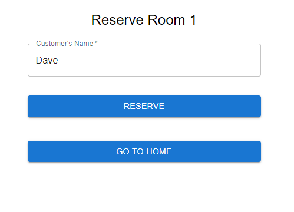
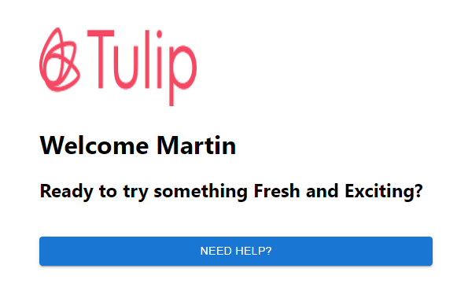

<a name="readme-top"></a>

[![MIT License][license-shield]][license-url]
[![LinkedIn][linkedin-shield]][linkedin-url]


<!-- PROJECT LOGO -->
<br />
<div align="center">

  <h3 align="center">Change Room Micro App Front end</h3>

  <p align="center">
   Developed as part of Tulip Hackday 2023!
    <br />

</div>


<!-- TABLE OF CONTENTS -->
<details>
  <summary>Table of Contents</summary>
  <ol>
    <li>
      <a href="#about-the-project">About The Project</a>
      <ul>
        Project</a>
        <li><a href="#built-with">Built With</a></li>
      </ul>
    </li>
    <li>
      <a href="#getting-started">Getting Started</a>
      <ul>
        <li><a href="#prerequisites">Prerequisites</a></li>
        <li><a href="#installation">Installation</a></li>
      </ul>
    </li>
    <li><a href="#usage">Usage</a></li>
    <li><a href="#roadmap">Roadmap</a></li>
    <li><a href="#contributing">Contributing</a></li>
    <li><a href="#Special-Thanks">Special Thanks</a></li>
    <li><a href="#contact">Contact</a></li>
  </ol>
</details>


<!-- ABOUT THE PROJECT -->
## About The Project






As part of Tulip Hackday 2023, I developed Change Room Micro App. Which solves the issue of getting hold of changeroom inside partner retail stores and enables seamless and hassalefree retail experience for customers.

Here's why:
* Associates can see which rooms are available.
* Change rooms will be equipped with display to greet customers and show status of room.
* Customers can intaract with display inside change room to request for assistance :smile:


### Built With

This section should list any major frameworks/libraries used to bootstrap your project. Leave any add-ons/plugins for the acknowledgements section. Here are a few examples.


* [![React][React.js]]
* [![Material UI][Material-UI]]
* [![Axios][Axios]]
* [![NodeJS][Node.js]]
* [![ExpressJS][Express]]
* [![MongoDB][Mongo]]


<!-- GETTING STARTED -->
## Getting Started

This is an example of how you may give instructions on setting up your project locally.
To get a local copy up and running follow these simple example steps.

### Prerequisites

This is an example of how to list things you need to use the software and how to install them.
* npm
  ```sh
  1. install npm package
  2. mongodb Database
  ```

### Installation

_Below is an example of how you can instruct your audience on installing and setting up your app. This template doesn't rely on any external dependencies or services._

1. Get a MongoDB database connection string API Key at [https://cloud.mongodb.com/](https://cloud.mongodb.com/)
2. Clone the repo
   ```sh
   git clone https://github.com/DharmaySureja/ChangeRoomMicroApp_frontend
   ```
3. Install NPM packages
   ```sh
   npm install
   ```
4. Enter your MongoDB config URL in `.env`
   ```js
   MONGODB_URL = 'ENTER YOUR MongoDB URL';
   ```
3. Build package
   ```sh
   npm run build
   ```
3. Start NPM server
   ```sh
   npm start
   ```


<!-- USAGE EXAMPLES -->
## Usage

Use this space to show useful examples of how a project can be used. Additional screenshots, code examples and demos work well in this space. You may also link to more resources.

_For more examples, please refer to the [Documentation](https://example.com)_


<!-- ROADMAP -->
## Roadmap

- [x] Change Room display support
- [x] Associate reservation capability
- [ ] Fetch customer names from pool
- [ ] Web Socket support
- [ ] Multi-Store Support
    


<!-- CONTRIBUTING -->
## Contributing

Contributions are what make the open source community such an amazing place to learn, inspire, and create. Any contributions you make are **greatly appreciated**.

If you have a suggestion that would make this better, please fork the repo and create a pull request. You can also simply open an issue with the tag "enhancement".
Don't forget to give the project a star! Thanks again!

1. Fork the Project
2. Create your Feature Branch (`git checkout -b feature/Somethingnew`)
3. Commit your Changes (`git commit -m 'Add some Out of box stuff'`)
4. Push to the Branch (`git push origin feature/Somethingnew`)
5. Open a Pull Request


<!-- LICENSE -->
## License

Distributed under the MIT License. 


## Special-Thanks

[Tulip] (https://www.tulip.com/)


<!-- CONTACT -->
## Contact

Dharmay Sureja - [LinkedIN](https://www.linkedin.com/in/dharmay-sureja-6349b0192/)

## Project Repo
Project Link: [Frontend](https://github.com/DharmaySureja/ChangeRoomMicroApp_frontend)

Project Link: [Backend](https://github.com/DharmaySureja/ChangeRoomMicroApp_backend)


<p align="right">(<a href="#readme-top">back to top</a>)</p>


<!-- MARKDOWN LINKS & IMAGES -->
<!-- https://www.markdownguide.org/basic-syntax/#reference-style-links -->

[license-shield]: https://img.shields.io/github/license/othneildrew/Best-README-Template.svg?style=for-the-badge
[license-url]: https://github.com/othneildrew/Best-README-Template/blob/master/LICENSE.txt
[linkedin-shield]: https://img.shields.io/badge/-LinkedIn-black.svg?style=for-the-badge&logo=linkedin&colorB=555
[linkedin-url]: https://www.linkedin.com/in/dharmay-sureja-6349b0192/


[React.js]: https://img.shields.io/badge/React-20232A?style=for-the-badge&logo=react&logoColor=61DAFB
[React-url]: https://reactjs.org/
[Node.js]: https://img.shields.io/badge/Node-20232A?style=for-the-badge&logo=npm&logoColor=4FC08D

[Axios]: https://img.shields.io/badge/AXIOS-20232A?style=for-the-badge&logo=axios&logoColor=white

[Express]: https://img.shields.io/badge/Express-20232A?style=for-the-badge&logo=express&logoColor=white

[Mongo]: https://img.shields.io/badge/MongoDB-20232A?style=for-the-badge&logo=mongodb&logoColor=white
[Bootstrap-url]: https://getbootstrap.com

[Material-UI]: https://img.shields.io/badge/Material--UI-20232A?style=for-the-badge&logo=t&logoColor=White


